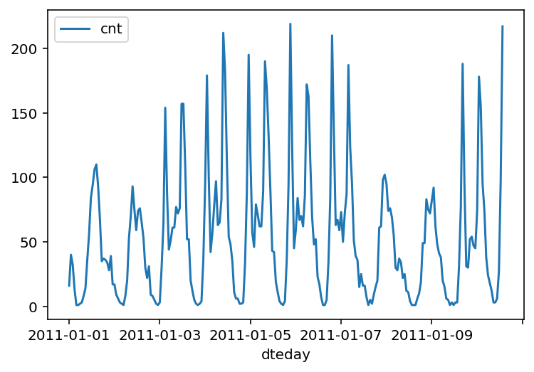

# Predicting_Bike_Sharing_Patterns_Deeplearning_Udacity
This project is a part of Udacity Deeplearning Nanodegree

The first Udacity Project from the Deep Learning Nanodegree. Using only Numpy to implement forward and back propagation to predict Bike-Sharing Patterns.

The Neural network was built from "scratch", using only NumPy to assist. The goal of this project is to understand what happens behind the neural network before diving deeper into other tools like TensorFlow.

# Results
The project meets the specifications, which are:

- All the code in the notebook runs in Python 3 without failing, and all unit tests pass.
- The sigmoid activation function is implemented correctly
- The forward pass is correctly implemented for the network's training.
- The run method correctly produces the desired regression output for the neural network.
- The network correctly implements the backward pass for each batch, correctly updating the weight change.
- Updates to both the input-to-hidden and hidden-to-output weights are implemented correctly.
- The number of epochs is chosen such the network is trained well enough to accurately make predictions but is not overfitting to the training data.
- The number of hidden units is chosen such that the network is able to accurately predict the number of bike riders, is able to generalize, and is not overfitting.
- The learning rate is chosen such that the network successfully converges, but is still time efficient.
- The number of output nodes is properly selected to solve the desired problem.
- The training loss is below 0.09 and the validation loss is below 0.18.

## Architecture used here is shown below

## Number of Bike riders in 10 days are shown below

Network Architure is Available in `my_answers.py` file

## Train and Validation loss is shown below

## After training for 5000 iterations our prediction result is given below

